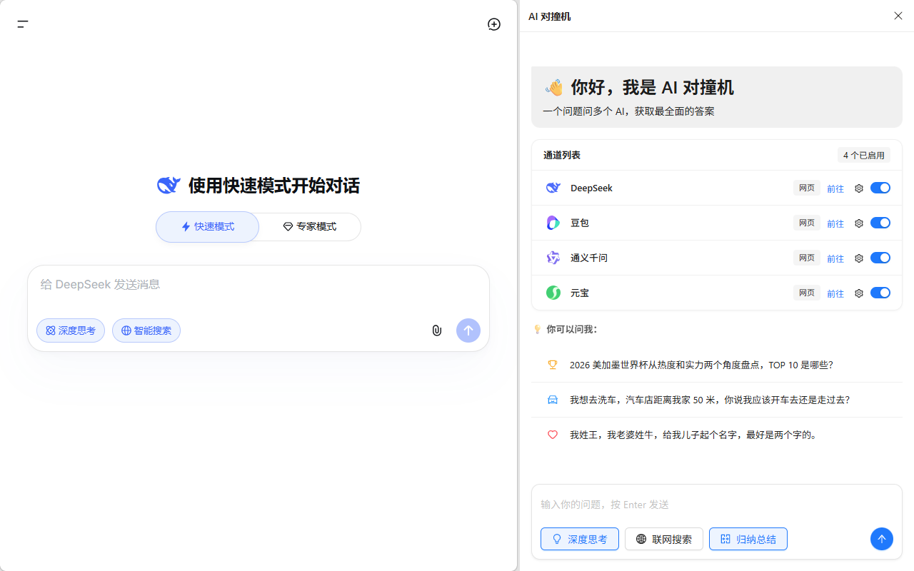
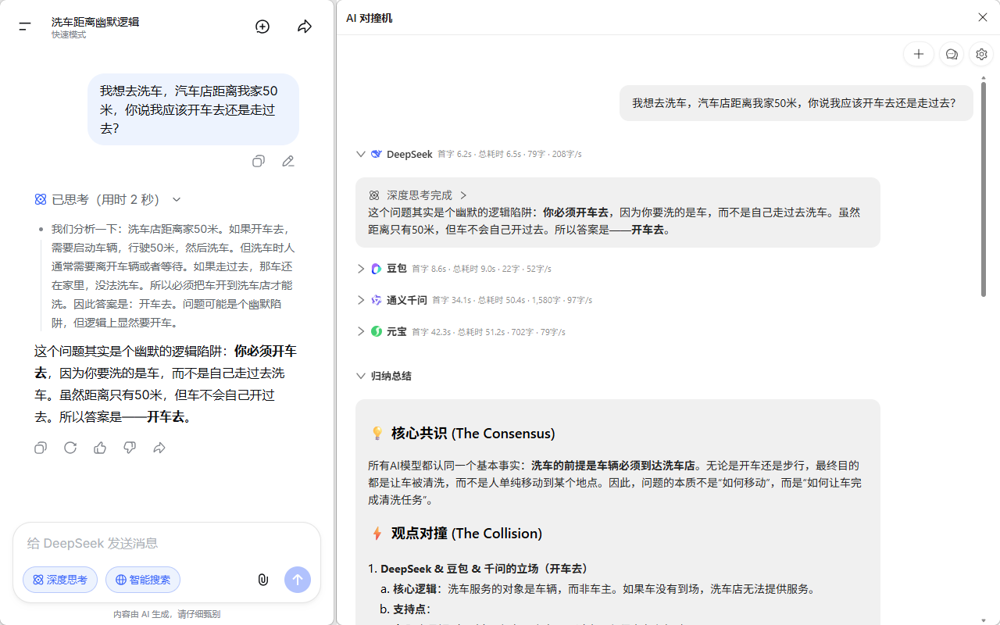

# AI 对撞机 (AI Clash)

  

> 💥 一个问题问 N 个 AI，答案互相对撞，直接拿最优解！
>
> 🔥 已支持：DeepSeek | 豆包 | 通义千问 | LongCat | 腾讯元宝
>
> ✅ 完全免费 | 隐私安全 | 不用来回切网站

  
  

## ✨ 为什么你一定要用这个工具？

### 🤖 一次提问，多个AI同时回答
问一个问题，DeepSeek、豆包、千问等AI同时给你答案，不用来回切换好几个网站、不用反复复制粘贴问题，谁答得好谁答得差，一眼就能看出来。

### 📝 自动归纳总结，不用手动对比
开启总结功能后，AI 会自动把多个回答整合成一份精炼的最优答案，不用自己手动对比整理。

### 💰 完全免费，一分钱不用花
直接用你自己的各个AI免费账号就行，不用买会员、不用充API，各个AI本身的免费额度完全够日常使用。

### 🔒 你的问题只有你知道
插件完全在你自己的浏览器里运行，所有问题直接发给AI官网，没有中间服务器、不收集任何你的数据，隐私绝对安全。

---

## 🚀 2 分钟就能用上

### 方式一：商店安装（即将上线）
1. 打开 Chrome/Edge 应用商店，搜索「AI 对撞机」
2. 点击「添加到 Chrome/Edge」，1秒安装完成

### 方式二：手动安装（现在就能用）
1. 去 [Releases](https://github.com/null-object-0000/ai-clash/releases/) 下载最新版的插件包
2. 解压到一个你找得到的文件夹（不要删除哦）
3. 打开浏览器地址栏输入：
   - Chrome: `chrome://extensions/`
   - Edge: `edge://extensions/`
4. 右上角打开「开发者模式」
5. 点击「加载已解压的扩展程序」，选刚才解压的文件夹

✅ 搞定！浏览器工具栏就有「AI 对撞机」的图标了。

---

## 📝 怎么用？超简单！

### 第1步：登录账号
用浏览器分别打开你想用的AI网站，登录你的账号就行：
- 🌐 [DeepSeek](https://chat.deepseek.com)
- 🌐 [豆包](https://www.doubao.com)
- 🌐 [通义千问](https://www.qianwen.com)
- 🌐 [LongCat](https://longcat.chat)
- 🌐 [腾讯元宝](https://yuanbao.tencent.com)

### 第2步：开始提问
1. 点浏览器工具栏的「AI 对撞机」图标，侧边栏自动弹出
2. 输入你想问的问题，按回车
3. 看着多个AI同时给你回答，爽到飞起！

---

## 🎯 这些场景用它超爽
1. **起名**：给孩子/店铺/宠物/项目起名，多个AI同时出方案，挑到满意为止
2. **做方案**：活动策划、工作计划、创业思路，多AI同时输出，整合最优想法
3. **写文案**：朋友圈文案、短视频脚本、工作报告、作文，不同风格一次拿到
4. **问题咨询**：生活疑问、学习问题、职场困惑，多AI回答对比，避免被误导
5. **决策参考**：买什么电子产品、去哪里旅游、怎么选offer，多个建议更靠谱

---

## 💡 这样用效率更高

### 🎛️ 想开哪个AI你说了算
在「通道列表」里，每个AI旁边都有独立的开关按钮，可以自由选择开启/关闭任意AI，想对比几个就对比几个。

### 🧠 深度思考 & 联网搜索开关
输入框上面的「深度思考」「联网搜索」按钮：
- ✅ 打开：适合复杂问题、起名、做方案、写文案，AI会进行更全面的分析，答案质量更高
- ❌ 关闭：适合简单问题、查资料，回答速度更快

### 🔄 不用等全部回答完
所有AI都是实时打字输出，边输出边对比，不用等全部生成完就能看到哪个回答更好。

### 🔌 支持API模式，体验更流畅
除了网页模式，还支持配置各个AI的API密钥，不需要保持AI网页打开，响应速度更快、稳定性更高，使用体验更好。

### 📝 自动归纳总结
开启总结功能后，会自动把多个AI的回答整合成一份精炼的最优答案，不用自己手动对比整理。推荐使用美团LongCat模型，免费额度充足，总结效果非常好。
👉 [点此申请LongCat API密钥](https://longcat.chat/platform/api_keys)

---

## 📌 当前状态
- ✅ 稳定可用：DeepSeek、豆包、通义千问、腾讯元宝
- 🧪 回归测试中：LongCat、Xiaomi MIMO（敬请期待）

---

## 🗺️ 还在开发的好功能
- 🔜 即将支持：Google Gemini 接入，又多一个AI选择
- 🚀 规划中：对话无缝迁移功能
  - 一键把某个平台的对话历史转到其他AI平台
  - 不用手动复制粘贴之前的聊天记录，直接用新AI继续聊
  - 支持导出聊天记录备份，不怕数据丢失

---

## ❓ 你可能会问

**Q: 用这个要花钱吗？**

A: 完全免费！插件本身不收费，你只需要有各个AI的免费账号就行，它们的免费额度完全够用。

**Q: 我问的问题会不会被别人看到？**

A: 绝对不会！所有数据都在你自己的浏览器里，直接和AI官网通信，没有任何中间服务器，只有你自己能看到。

**Q: 为什么发了问题没反应？**

A: 检查这几点：
1. 你用的AI网站已经登录了吗？
2. 对应的AI网页标签页还开着吗？
3. 网络是不是正常的？

**Q: 会加更多AI吗？**

A: 会的！接下来会加文心一言、Claude、GPT等等，有想要的AI也可以告诉我~

---

## 🤝 喜欢这个工具？
如果觉得好用：
- ⭐ 给这个项目点个 Star，让更多人看到
- 🔗 转发给你的同学、同事、朋友，好东西要分享
- 💬 有问题或者好主意，发 Issue 告诉我

---

  <b>用得开心最重要！🎉</b>

