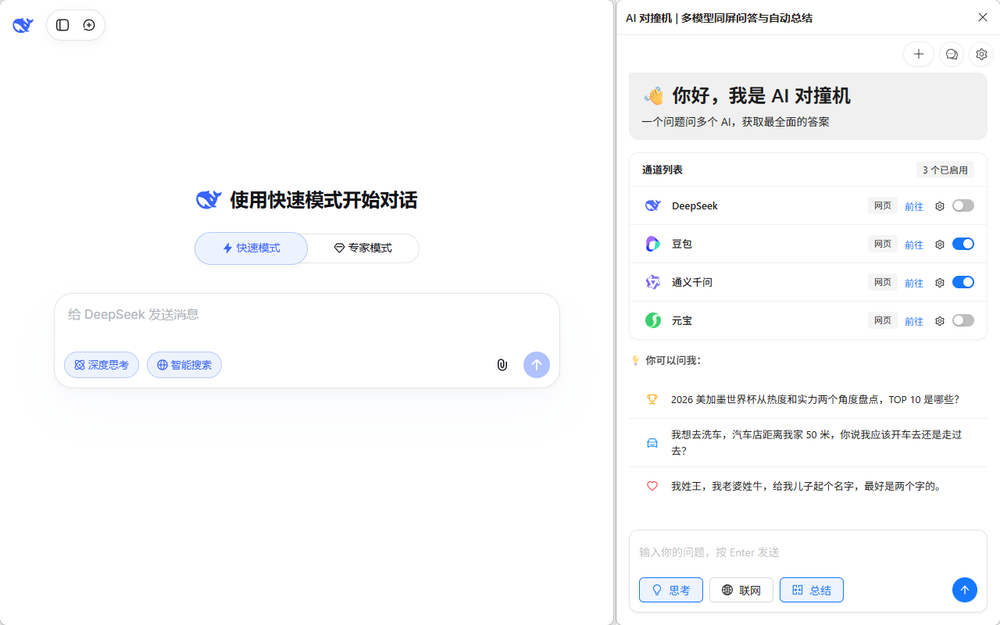
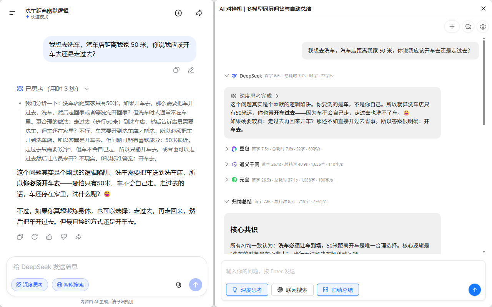
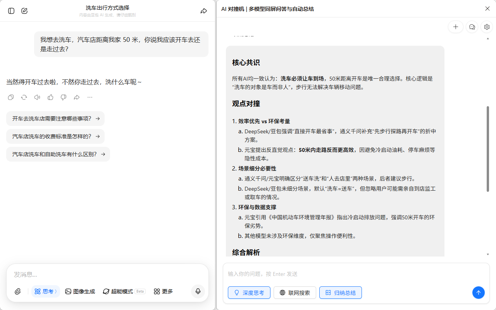

# AI 对撞机 (AI Clash)

  

> 💥 一个问题问 N 个 AI，答案互相对撞，直接拿最优解！
>
> 🔥 已支持：DeepSeek | 豆包 | 通义千问 | 腾讯元宝 | 文心一言 | Xiaomi MIMO

  

## ✨ 为什么你一定要用这个工具？

* ⚔️ **打破“高自信幻觉”**

  没有全能的 AI，只有偏科的专家。遇到复杂代码或硬核调研，单一模型极易一本正经地胡说八道。我们让你**一次提问，全网顶级模型同屏作答**，谁的逻辑有漏洞一眼便知。

* ⚖️ **消灭信息过载**

  看着屏幕上四篇冗长的回答感到头疼？内置的 **「AI 裁判」** 会自动为你归纳总结，梳理各方争议与共同点，直接提炼出最具置信度的终极答案。

* 🆓 **拒绝 API 阉割，满血网页体验**

  **为什么不直接用 API 聚合？** 除了昂贵的 Token 成本，API 往往会丢失官方网页版最核心的“隐藏 BUFF”。本插件采用纯本地 DOM Hook 技术，完美继承各大平台精心调优的**内置系统提示词、原生上下文记忆系统以及专属联网/沙盒能力**，让你零成本体验真正的“满血版” AI 集群。

* 🛑 **告别繁琐的“切网页”内耗**

  还在不同的 AI 标签页之间来回切换、疯狂复制粘贴？这简直反人类！我们把所有顶级大模型汇聚在一个侧边栏里。**一次提问，同屏对比，一目了然**，彻底释放你的屏幕空间，把精力全花在思考而不是切网页上。

## 🚀 2 分钟就能用上

### 方式一：商店安装

1. 打开 Chrome/Edge 应用商店，搜索「AI 对撞机」
2. 点击「添加到 Chrome/Edge」，1秒安装完成

### 方式二：手动安装（现在就能用）

1. 去 [Releases](https://github.com/null-object-0000/ai-clash/releases/) 下载最新版的插件包
2. 解压到一个你找得到的文件夹（不要删除哦）
3. 打开浏览器地址栏输入：
   * Chrome: `chrome://extensions/`
   * Edge: `edge://extensions/`
4. 右上角打开「开发者模式」
5. 点击「加载已解压的扩展程序」，选刚才解压的文件夹

✅ 搞定！浏览器工具栏就有「AI 对撞机」的图标了。

## 📝 怎么用？超简单

### 第 1 步：账号授权（一次性操作）

首次使用时，只需用浏览器登录一下你想用的 AI 网站，让它保持登录状态即可（不需要一直开着网页）

### 第 2 步：呼出对撞机

点击浏览器右上角的「AI 对撞机」扩展图标，召唤出魔法侧边栏。

### 第 3 步：提问，然后看戏

输入你想问的问题，按下回车。

**✨ 黑科技体验**：你完全不需要手动去开各家的网页，插件会在后台**自动为你唤醒**对应的 AI 标签页并开始静默工作。你只需喝口水，欣赏 4 大顶级 AI 同屏为你疯狂输出的震撼场面！

## 🎯 这些场景用它超爽

1. **起名**：给孩子/店铺/宠物/项目起名，多个AI同时出方案，挑到满意为止
2. **做方案**：活动策划、工作计划、创业思路，多AI同时输出，整合最优想法
3. **写文案**：朋友圈文案、短视频脚本、工作报告、作文，不同风格一次拿到
4. **问题咨询**：生活疑问、学习问题、职场困惑，多AI回答对比，避免被误导
5. **决策参考**：买什么电子产品、去哪里旅游、怎么选offer，多个建议更靠谱

  

  
  

## 💡 这样用效率更高

### 🎛️ 想开哪个AI你说了算

在「通道列表」里，每个AI旁边都有独立的开关按钮，可以自由选择开启/关闭任意AI，想对比几个就对比几个。

### 🧠 深度思考 & 联网搜索开关

输入框上面的「深度思考」「联网搜索」按钮：

* ✅ 打开：适合复杂问题、起名、做方案、写文案，AI会进行更全面的分析，答案质量更高
* ❌ 关闭：适合简单问题、查资料，回答速度更快

### 🔄 不用等全部回答完

所有AI都是实时打字输出，边输出边对比，不用等全部生成完就能看到哪个回答更好。

### 🔌 进阶玩法：支持本地 API 接入 (重度极客专属)

虽然我们的核心是“零成本白嫖网页版”，但如果你是拥有高频并发需求的极客玩家，不想在后台挂着多个网页，插件同样支持配置各个大模型的 API Key。网页 Hook 与纯 API 模式互为补充，丰俭由人。

### 📝 专属 AI 裁判：一键自动归纳总结

开启总结功能后，插件会自动把多个 AI 的回答整合成一份精炼的最优答案。

* **🎁 开箱即用（默认）**：插件已经**免费内置了由「AI 对撞机」官方提供的专属总结服务**。零配置，零门槛，点开侧边栏直接就能用！
* **💡 进阶推荐（自定义专属裁判）**：如果你是高频重度用户，强烈推荐配置美团 LongCat 的 API 作为你的私人专属裁判。目前其免费额度极其充足，逻辑清晰，且完全不消耗你本地网页版的额度。👉 [点此申请 LongCat 免费 API 密钥](https://longcat.chat/platform/api_keys)

## ❓ 你可能会问

**Q: 用这个要花钱吗？**

A: 完全免费！插件本身不收费，你只需要有各个 AI 的免费账号就行，它们的免费额度完全够用。

**Q: 我问的问题会不会被别人看到？**

A: 绝对不会！所有数据都在你自己的浏览器里，直接和 AI 官网通信，没有任何中间服务器，只有你自己能看到。

**Q: 为什么发了问题没反应？**

A: 请检查这 2 点：

1. 你使用的那个 AI 网站，**登录状态是不是过期了**？（如果是，点击去官网重新扫码登录一下即可）。
2. 本地网络是否正常。

**Q: 会加更多AI吗？**

A: 会的！接下来会加 XiaomiMiMo、LongCat、ChatGPT、Gemini 等等，有想要的AI也可以告诉我~

## 🤝 喜欢这个工具？

如果觉得好用：

* ⭐ 给这个项目点个 Star，让更多人看到
* 🔗 转发给你的同学、同事、朋友，好东西要分享
* 💬 有问题或者好主意，发 Issue 告诉我

---

  <b>用得开心最重要！🎉</b>

